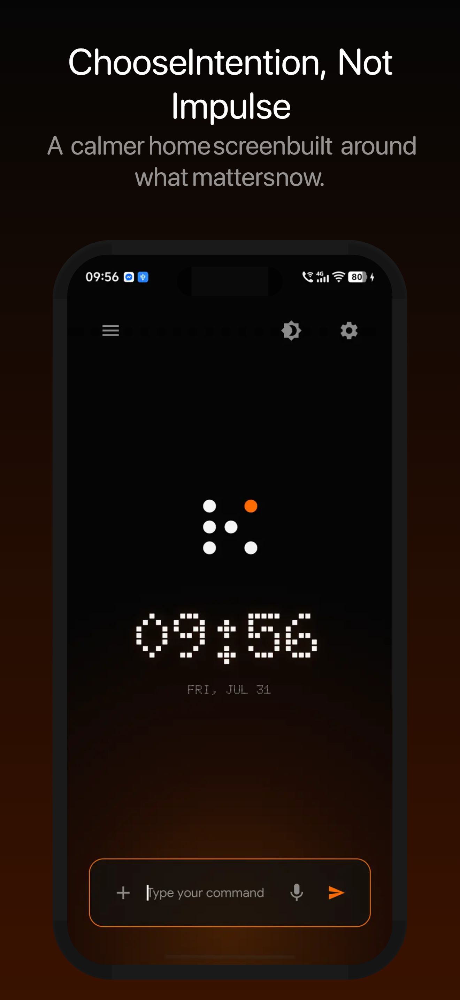
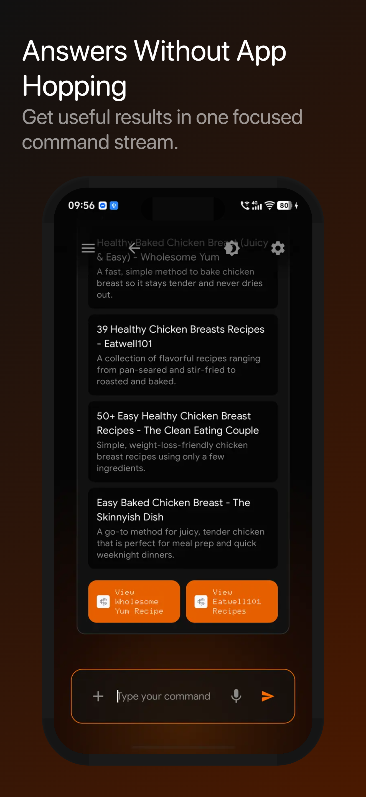
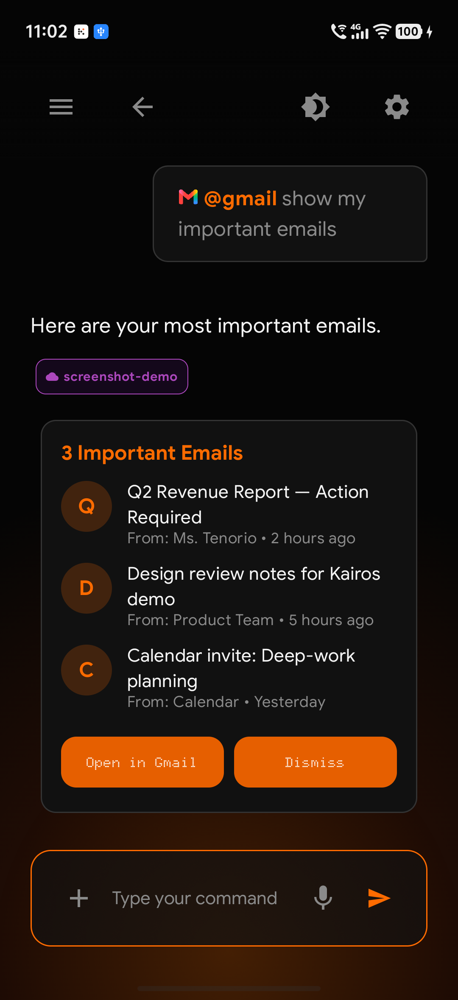
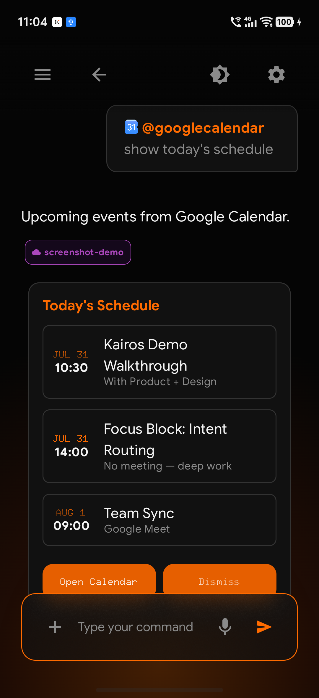
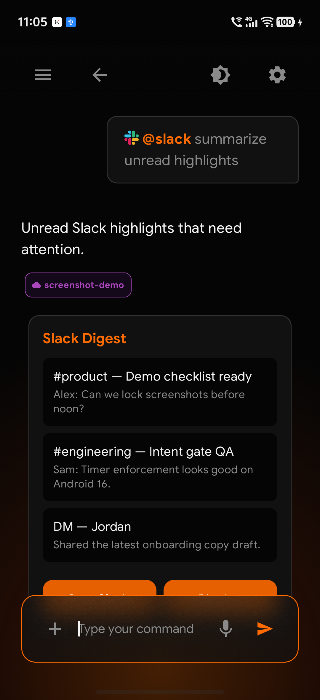
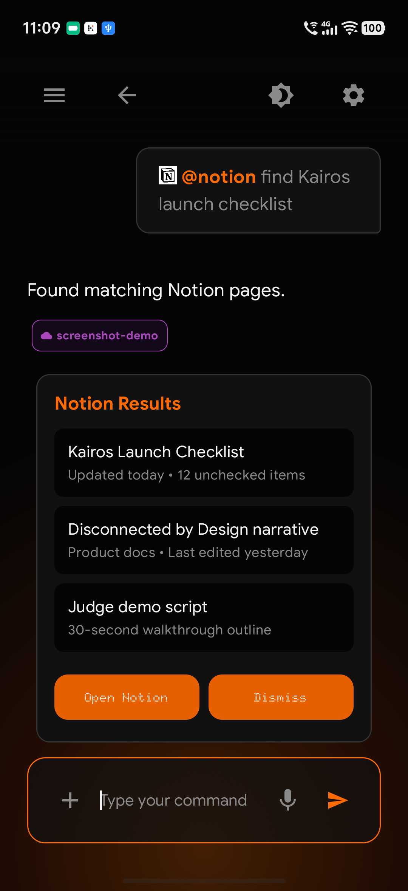
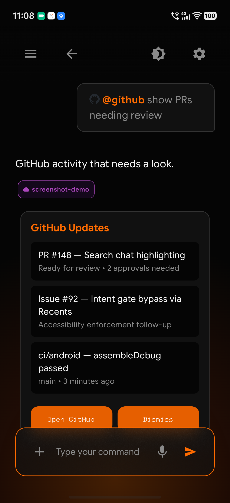
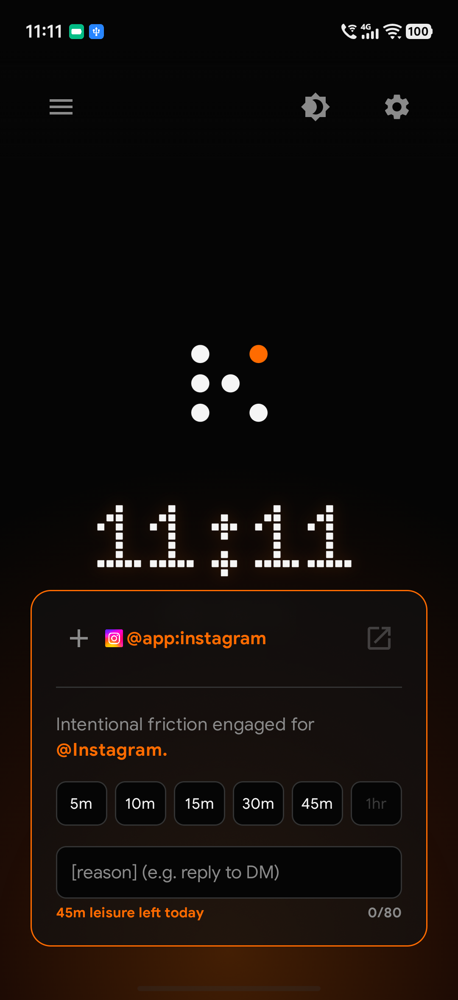
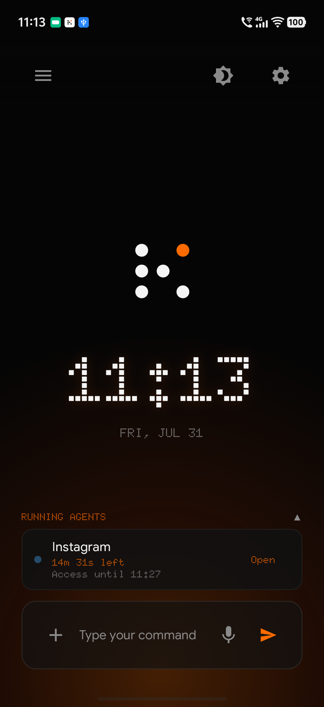

<p align="center">
  
</p>

<h1 align="center">KaiOS</h1>

<p align="center"><strong>Your phone, blank until you mean it.</strong></p>

<p align="center">
  A text-first Android launcher that replaces the app grid with a single command line.<br />
  Articulate intent — through connectors, local apps, and intentional friction for distracting apps.
</p>

<p align="center">
  
</p>

---

## What it is

Modern phones make impulse the default. KaiOS flips that: the home screen is a calm, terminal-like slate. Nothing happens until you type what you want.

```
@gmail show my important emails
@google-calendar what's on my schedule tomorrow
@instagram /open --reason "reply to DM" --time 5m
```

Commands route through a thin Android client to a Next.js backend that handles AI routing, MCP integrations, and structured UI responses. The phone stays a presentation layer — the brain lives on the server.

See [PRODUCT.md](PRODUCT.md) for product context and [DESIGN.md](DESIGN.md) for the visual system.

---

## Features

### Command homescreen

No icon grid. A clock, a cursor, and a command bar. Color shows up when something is active — Focus Orange for intent, monochrome for everything else.

<p align="center">
  
  &nbsp;
  
</p>

### Connectors & widgets

Point a command at a service with `@app`. The backend returns structured widgets — email cards, calendar blocks, digests — not raw markdown. Read in the stream; act via deep links when you need the native app.

<p align="center">
  
  &nbsp;
  
  &nbsp;
  
</p>

<p align="center">
  
  &nbsp;
  
</p>

### Intentional friction

Utility apps open immediately. Trap apps (Instagram, TikTok, and anything you mark as distracting) hit an **intent gate**: state a reason and a time limit before the OS lets you through. Leisure has a daily budget; mindless opens do not.

<p align="center">
  
  &nbsp;
  
</p>

---

## Architecture

```
┌─────────────────────┐         ┌──────────────────────────────────┐
│   Android client    │  HTTP   │         Next.js backend          │
│  (thin launcher)    │ ──────► │  Intent router · AI · MCP tools  │
│                     │ ◄────── │  Widget JSON · deep-link cmds    │
└─────────────────────┘         └──────────────────────────────────┘
```

| Layer | Role |
|---|---|
| **Android** | Capture input, render widgets, fire deep links / local intents |
| **Backend** | Classify intent, call models & MCPs, return `KairosResponse` JSON |
| **Integrations** | Gmail, Calendar, Slack, Notion, GitHub, and more via MCP / APIs |

Paradigm: **read via widgets, execute via deep links.**

---

## Repository layout

```
android/     # Kotlin · Jetpack Compose launcher
backend/     # Next.js API + landing / waitlist
assets/      # Brand SVGs
screenshots/ # Product screenshots (integrations/)
PRODUCT.md   # Product context
DESIGN.md    # Design system tokens
```

---

## Getting started

### Backend

```bash
cd backend
npm install
npm run dev
```

Configure environment variables as needed (see `backend/` — never commit `.env` files). The landing page and API live here.

### Android

Open `android/` in Android Studio, sync Gradle, and run on a device or emulator. Point the client at your local or deployed backend URL.

---

## Brand

| Token | Value |
|---|---|
| Focus Orange | `#ff6b00` |
| Void | `#050505` |
| Foreground | `#f5f5f5` |
| Voice | Intentional · Terminal · Focused |

---

## License

All rights reserved unless a `LICENSE` file is added to this repository.
